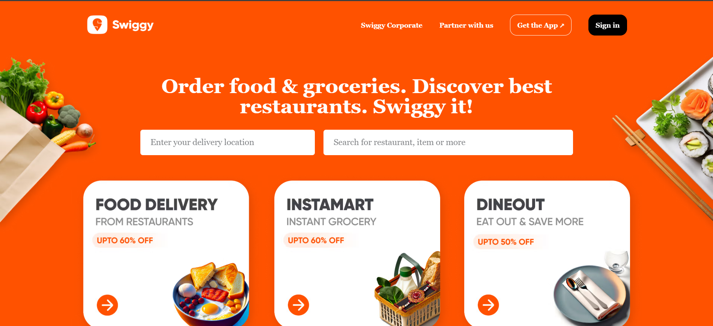
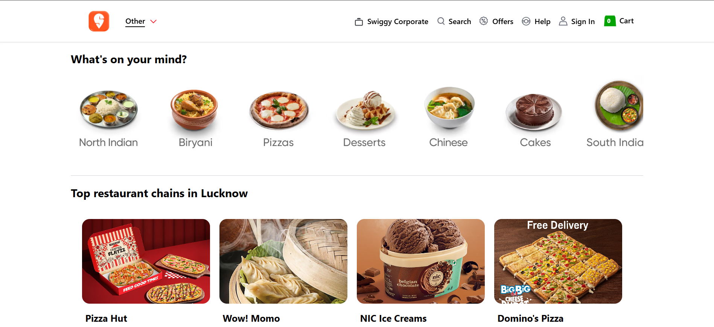
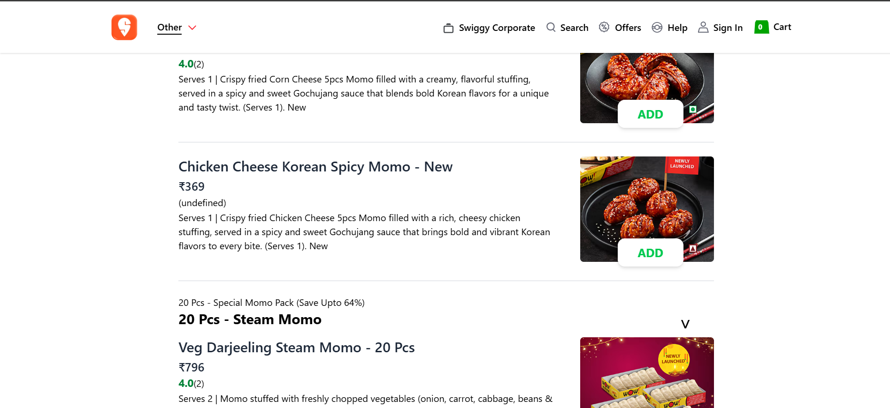
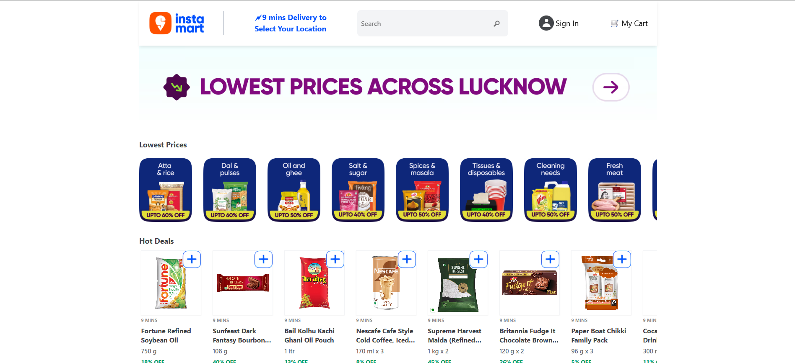
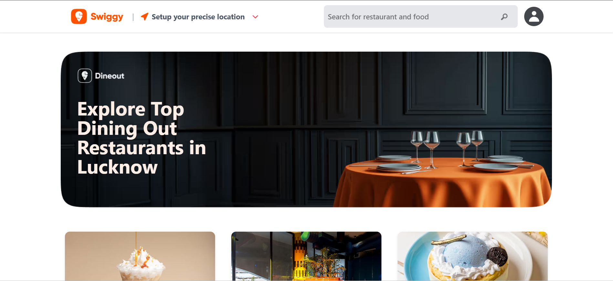

# 🍔 Swiggy Functional Clone (React + Redux | Live Swiggy API)

A functional Swiggy frontend clone that integrates **Live Swiggy APIs**, implements **Redux state management**, and recreates major Swiggy features like **Restaurant menus, Instamart, Dineout, cart functionality, search, and filters**.

The project consumes live Swiggy API data and dynamically renders restaurant menus, product pages, and dineout listings.

Since the official API blocks external requests due to CORS restrictions, a third-party proxy is used to access the data.

This project focuses on building **scalable frontend architecture**, handling **complex UI states**, and implementing **real-world frontend features**.

⚠️ **Disclaimer**

This project is for educational purposes only and is not affiliated with Swiggy.  
All trademarks and API data belong to Swiggy.

---

# 🚀 Live Demo

🌐 **Deployed App**

https://swiggy-clone-fl83.onrender.com/

📂 **GitHub Repository**

https://github.com/hemant-kushwaha/Swiggy_Clone.git

---

# ✨ Key Features

## 🏠 Landing Page
- Swiggy-style homepage UI
- **Signup Modal**
- Navigation to:
  - Restaurants
  - Instamart
  - Dineout

---

## 🍽 Restaurants

### Restaurant Collection Page
- Dynamic restaurant list fetched from live API
- Clicking a restaurant opens the **Restaurant Menu Page**

### Restaurant Page
Features implemented:

- 🔍 Search for dishes  
- 🛒 Add to cart functionality  
- ⚛ Redux-based cart state management  
- 🥦 Veg / Non-Veg filtering  
- 📂 Category expand / collapse functionality  
- ⚡ Dynamic menu rendering  

---

## 🛒 Instamart

- Instamart items list fetched dynamically
- Clicking an item opens a **full-screen product view page**

---

## 🍷 Dineout

### Dineout Collection Page
- Restaurant cards with:
  - Auto-changing images every **3 seconds**
  - **Show More** functionality

### Individual Dineout Page
Uses **conditional rendering** to switch between:

- Restaurant Info
- Photos
- Menu

---

# ⚡ UX Enhancements

- ✨ Shimmer loading effects
- 🔝 Scroll-to-top on route change
- 🎨 Hidden scrollbar UI where required
- 🖥 Desktop Screen Guard (App optimized for desktop view)
- 🔄 Dynamic UI rendering based on API data

---

# 🧠 Engineering Challenges Solved

### Handling Swiggy API CORS Restrictions
Swiggy APIs block external requests.  
A **third-party CORS proxy** is used to fetch live data.

### Race Condition Handling
When navigating between restaurants quickly, multiple API calls can overlap.

Logic was implemented to ensure **only the latest API response updates the UI**.

### Dynamic Menu Rendering
Restaurant menus contain **nested categories and item groups**.

Implemented:
- Expand / collapse category logic
- Dynamic rendering of nested menus

### Centralized State Management
Redux is used for:

- Cart management
- API request state
- Shared UI state

---

# 🛠 Tech Stack

- **React**
- **Redux**
- **React Router DOM**
- **Tailwind CSS**
- **JavaScript**
- **Swiggy API**

---

# ⚙️ Installation & Setup

### 1️⃣ Clone the repository

```bash
git clone https://github.com/hemant-kushwaha/Swiggy_Clone.git
```

### 2️⃣ Navigate to project directory

```bash
cd Swiggy_Clone
```

### 3️⃣ Install dependencies

```bash
npm install
```

### 4️⃣ Start development server

```bash
npm start
```

Application will run at:

```
http://localhost:3000
```

---

# ⚠️ Important Notes

- The project uses **live Swiggy APIs**
- Due to **CORS restrictions**, requests are routed through a **third-party proxy**
- Some static data is used where Swiggy relies on **Server-Side Rendering (SSR)**

---

# 📸 Screenshots

## 🏠 Landing Page


---

## 🍽 Restaurant Collection Page


---

## 🍽 Restaurant Page


---

## 🛒 Instamart


---

## 🍷 Dineout


---

# 📈 Future Improvements

- Mobile responsive design
- Checkout workflow
- Authentication system
- Persistent cart storage
- Performance optimization
- Remove dependency on third-party CORS proxy

---

---
# 👨‍💻 Author

**Hemant Kushwaha**

GitHub:  
https://github.com/hemant-kushwaha

---

⭐ If you like this project, please consider **starring the repository**.